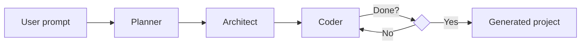

# Adra-AI

A multi-agent coding assistant that turns a natural-language project prompt into a working codebase. Built with [LangGraph](https://langchain-ai.github.io/langgraph/) and LangChain, Adra-AI runs a three-stage pipeline—**Planner → Architect → Coder**—to plan, decompose, and implement software projects step by step.

## How it works



1. **Planner** — Converts your prompt into a structured project plan: app name, description, tech stack, features, and target files.
2. **Architect** — Breaks the plan into ordered implementation steps, each with a file path and detailed task description.
3. **Coder** — Executes one step at a time using file tools (`read_file`, `write_file`, `list_files`) to create and update code in `generated_project/`.

The coder loops until every architect step is complete.

## Features

- **Structured planning** — Pydantic schemas enforce consistent plans and task breakdowns.
- **Step-by-step implementation** — Each file is built in dependency order with context from prior steps.
- **Sandboxed file I/O** — All writes are confined to `generated_project/` for safety.
- **Pluggable LLM backend** — Defaults to Google Gemini; Groq models are supported via a one-line swap in `agent/graph.py`.

## Tech stack

| Layer | Tools |
|-------|-------|
| Orchestration | LangGraph, LangChain |
| LLM (default) | Google Gemini 2.5 Flash |
| LLM (optional) | Groq (GPT-OSS models) |
| Schemas | Pydantic v2 |
| Runtime | Python 3.12+ |

## Prerequisites

- Python **3.12+**
- An API key for your chosen LLM provider:
  - **Google Gemini** (default): [Google AI Studio](https://aistudio.google.com/apikey)
  - **Groq** (optional): [Groq Console](https://console.groq.com/)

## Installation

### Option A — uv (recommended)
- install uv first

```powershell
git clone https://github.com/adityaxxz/Adra-AI.git
cd Adra-AI

uv venv
.\.venv\Scripts\Activate.ps1

uv sync
  `or`
uv pip install -r pyproject.toml

```


## Configuration

Copy the example env file and add your API key:

```powershell
Copy-Item .env.example .env
```

Edit `.env` and set the key for your provider:

```env
# Default (Gemini)
GOOGLE_API_KEY="your-google-api-key"

# Optional — if using Groq instead (see agent/graph.py)
# GROQ_API_KEY="your-groq-api-key"
```

To switch to Groq, uncomment a `ChatGroq` line and comment out the `ChatGoogleGenerativeAI` line in `agent/graph.py`.

## Usage

Run the CLI and enter a project description when prompted:

```powershell
python main.py
```

Example prompt:

```text
Create a simple to-do list web application using HTML, CSS, and JavaScript
Create a simple calculator web application.
Create a simple blog API in FastAPI with a SQLite database.
```

Optional flags:

```powershell
python main.py --recursion-limit 100
python main.py -r 150
```

Generated files are written to **`generated_project/`**. Open the output (e.g. `index.html`) in a browser or run any backend commands described in the generated README or requirements.

## Project structure

```text
Adra-AI/
├── main.py                 # CLI entry point
├── agent/
│   ├── graph.py            # LangGraph pipeline (planner → architect → coder)
│   ├── state.py            # Pydantic models (Plan, TaskPlan, CoderState)
│   ├── prompts.py          # System prompts for each agent
│   └── tools.py            # File I/O tools (scoped to generated_project/)
├── generated_project/      # Output directory (created at runtime)
├── pyproject.toml
├── requirements.txt
└── .env.example
```

## Example workflow

```powershell
# 1. Install dependencies
uv sync

# 2. Configure API key
Copy-Item .env.example .env
# Edit .env and set GOOGLE_API_KEY

# 3. Run the agent
python main.py

# 4. Enter your prompt, then inspect generated_project/
```

## Switching LLM providers

In `agent/graph.py`, choose one provider:

```python
# Default
llm = ChatGoogleGenerativeAI(model="gemini-2.5-flash", temperature=0)

# Groq alternatives
# llm = ChatGroq(model="openai/gpt-oss-120b", temperature=0)
# llm = ChatGroq(model="openai/gpt-oss-20b", temperature=0)
```


