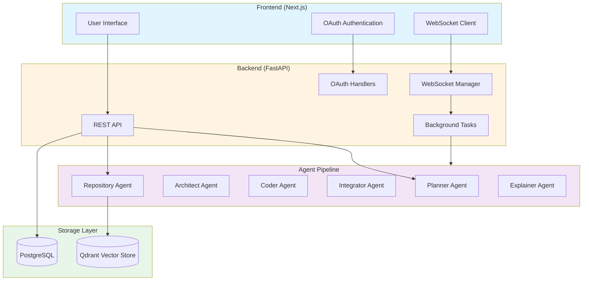
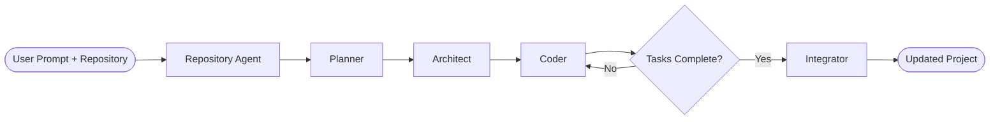
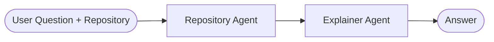

# Adra-AI

[](https://adra-ai.vercel.app)

A multi-agent coding assistant SaaS platform that turns natural-language prompts into working codebases or edits existing repositories. Built with [LangGraph](https://langchain-ai.github.io/langgraph/) and LangChain, Adra-AI features a modern web application with real-time updates and operates in three modes:

1. **Project Generation** — Creates new projects from scratch using a four-stage pipeline: Planner → Architect → Coder → Integrator
2. **Repository-Aware Editing** — Edits existing repositories with context-aware RAG (Retrieval-Augmented Generation)
3. **Question Answering** — Asks questions about codebases without making changes

## Architecture

Adra-AI now features a full SaaS architecture with:

- **Backend**: FastAPI with PostgreSQL database and Qdrant vector store
- **Frontend**: Next.js with React, TypeScript, and Tailwind CSS
- **Authentication**: OAuth 2.0 (Google & GitHub)
- **Real-time Updates**: WebSocket support for live progress tracking
- **Deployment**: Docker Compose setup for easy deployment

### Architecture Diagram



## How it works

### Project Generation Mode


1. **Planner** — Converts your prompt into a structured project plan: app name, description, tech stack, features, and target files.
2. **Architect** — Breaks the plan into ordered implementation steps, each with a file path and detailed task description. One step per file, ordered by dependency.
3. **Coder** — Executes one step at a time using file tools (`read_file`, `write_file`) to create and update code. Each step receives context from already-written sibling files so imports, exports, and APIs stay aligned as the project grows.
4. **Integrator** — After all coder steps finish, reads the full project and fixes cross-file issues: missing exports, mismatched imports, wrong paths, and logic bugs that block end-to-end behavior. Only files that need correction are rewritten.

### Repository-Aware Editing Mode



1. **Repository Agent** — Scans, chunks, and indexes the repository into Qdrant vector store; retrieves relevant code snippets via semantic search
2. **Planner** — Creates project plan using repository context to prefer modifying existing files over creating duplicate functionality
3. **Architect** — Breaks the plan into implementation steps with awareness of existing codebase structure
4. **Coder** — Implements changes using both project context and repository-specific code snippets
5. **Integrator** — Reviews and fixes cross-file integration issues in the updated codebase

### Question Answering Mode



1. **Repository Agent** — Retrieves relevant code snippets from the indexed repository based on the question
2. **Explainer Agent** — Analyzes the retrieved context and provides accurate answers about the codebase without making changes

## Features

### Core Features
- **Structured planning** — Pydantic schemas enforce consistent plans, task breakdowns, and integration results
- **Step-by-step implementation** — Each file is built in dependency order with live context from prior files
- **Cross-file integration pass** — The integrator agent reviews the whole codebase and patches integration bugs the coder may have missed
- **Centralized LLM client** — Throttled API calls, automatic retries on rate limits, and context truncation
- **Pluggable LLM backend** — Swap between Google Gemini and Groq models via configuration

### Repository-Aware Features
- **Repository scanning** — Automatically scans repositories for supported file types (Python, JavaScript, TypeScript, HTML, CSS, Markdown, JSON)
- **Code-aware chunking** — Language-specific chunking strategies (AST-based for Python, regex-based for JS/TS)
- **File hashing** — SHA256-based content hashing for change detection
- **Incremental indexing** — Only re-index changed files based on content hashes
- **Embedding generation** — Generates vector embeddings for semantic search
- **Vector store** — Qdrant-backed persistent storage for code chunks and embeddings
- **Semantic search** — Retrieves relevant code snippets based on natural language queries
- **GitHub integration** — Clone and index GitHub repositories automatically
- **Context-aware planning** — Leverages existing code patterns and structure when planning changes

### SaaS Platform Features
- **OAuth authentication** — Secure sign-in with Google and GitHub
- **User management** — Multi-tenant support with user-specific projects and repositories
- **Project management** — Create, view, and manage generated projects
- **Repository management** — Connect and index multiple repositories
- **Real-time updates** — WebSocket-based progress tracking for long-running tasks
- **Background processing** — Async task processing for agent operations
- **Rate limiting** — Configurable rate limits for API endpoints
- **Error handling** — Comprehensive error handling and logging

## Tech stack

| Layer | Tools |
|-------|-------|
| Frontend | Next.js 14, React 18, TypeScript, Tailwind CSS |
| Backend | FastAPI, Python 3.12+ |
| Database | PostgreSQL 16 |
| Vector Store | Qdrant 1.12.0 |
| Orchestration | LangGraph, LangChain |
| LLM (default) | Google Gemini 2.5 Flash |
| LLM (optional) | Groq (`openai/gpt-oss-120b`) |
| Authentication | OAuth 2.0 (Google, GitHub) |
| Real-time | WebSockets |
| Deployment | Docker, Docker Compose |
| State Management | Zustand |
| Data Fetching | TanStack Query |

## Prerequisites

- Docker and Docker Compose
- OAuth credentials (Google and/or GitHub)
- LLM API keys (Google Gemini, Groq, or other supported providers)

## Installation

### Option A — Docker Deployment (Recommended for Web App)

1. Clone the repository:
```bash
git clone https://github.com/adityaxxz/Adra-AI.git
cd Adra-AI
```

2. Configure environment variables:
```bash
cp .env.example .env
```

Open `.env` and fill in your credentials. Refer to [.env.example](.env.example) for descriptions of each environment variable.

3. Start all services:
```bash
docker-compose up -d
```

This will start:
- PostgreSQL (port 5432)
- Qdrant (port 6333)
- FastAPI Backend (port 8000)
- Next.js Frontend (port 3000)

4. Access the application:
- Frontend: http://localhost:3000
- Backend API: http://localhost:8000
- API Documentation: http://localhost:8000/docs

## Usage

### Web Application
1. **Authenticate**: Sign in with Google or GitHub OAuth.
2. **Create Project**: Use the UI to generate new projects.
3. **Connect Repository**: Add and index repositories for editing or Q&A.
4. **Track Progress**: Follow real-time generation logs via WebSockets.

### CLI Usage
For running Adra-AI locally via the command-line interface without the web application, see the [CLI Usage Guide](cli_usage.md).

## OAuth Setup

To configure authentication:
1. **Google OAuth**: Generate credentials in the [Google Cloud Console](https://console.cloud.google.com/).
2. **GitHub OAuth**: Create a new OAuth App in GitHub Developer settings.
3. Configure the redirect URIs in your developer console:
   - Local development: `http://localhost:3000/auth/[google|github]/callback`
   - Production: `https://adra-ai.vercel.app/auth/[google|github]/callback`
4. Add the generated credentials to your `.env` file.

## Advanced Repository Features

### Code-Aware Chunking
The system uses language-specific chunking strategies:

- **Python**: AST-based parsing to extract imports, classes, functions, and modules
- **JavaScript/TypeScript**: Regex-based parsing for functions, classes, and components
- **Markdown**: Section-based chunking by headers
- **Generic**: Recursive character splitting with overlap

### Incremental Indexing
- Files are hashed using SHA256 to detect changes
- Only modified files are re-indexed
- Deleted files are removed from the vector store
- Significantly reduces indexing time for large repositories

### File Hash Management
- Consistent hashing for content integrity
- Hash-based change detection
- Efficient incremental updates

## API Documentation

Once the backend is running, the interactive Swagger UI API documentation is available at `http://localhost:8000/docs`.

Key endpoints include:
- `POST /projects` - Create a new project
- `POST /repositories/{id}/index` - Index a repository
- `WS /ws/{session_id}` - WebSocket for real-time progress updates

## 🚀 Deployment 

### Live Production Architecture
The live project is fully deployed and configured using:
* **Frontend**: Deployed on [Vercel](https://vercel.com) (Next.js serverless app).
* **Backend**: Hosted on a [DigitalOcean Droplet](https://digitalocean.com) in the Bangalore (`blr1`) region, running:
  - **Docker Compose** container network (FastAPI API, PostgreSQL, Qdrant).
  - **Nginx** reverse proxy routing requests and handling WebSockets.
  - **Certbot / Let's Encrypt** for automated SSL/HTTPS.

### Quick Docker Deployment (Local)

```bash
docker-compose up -d
```

## Development

### Backend Development

```bash
cd backend
pip install -r requirements.txt
uvicorn main:app --host 0.0.0.0 --port 8000 --reload
```

### Frontend Development

```bash
cd frontend
npm install
npm run dev
```

### Running Tests

```bash
# Backend tests
cd backend
pytest

# Frontend tests
cd frontend
npm test
```

## Project Structure

```
Adra-AI/
├── agent/                 # Agent pipeline implementation
│   ├── graph.py          # LangGraph agent orchestration
│   ├── llm_client.py     # LLM client with throttling
│   ├── prompts.py        # Agent prompts
│   ├── repository/       # Repository-aware features
│   │   ├── code_aware_chunker.py
│   │   ├── file_hash.py
│   │   ├── scanner.py
│   │   ├── service.py
│   │   └── vector_store.py
│   └── tools.py          # File I/O tools
├── backend/              # FastAPI backend
│   ├── main.py           # API endpoints
│   ├── auth.py           # OAuth handlers
│   ├── db_models.py      # SQLAlchemy models
│   ├── websocket_manager.py
│   ├── background_tasks.py
│   └── services/
├── frontend/             # Next.js frontend
│   ├── app/
│   ├── components/
│   ├── api-client.ts
│   └── websocket-hook.ts
├── docker-compose.yml    # Docker services
├── main.py              # CLI entry point
└── requirements.txt     # Python dependencies
```

## Troubleshooting

### Docker Issues
```bash
# Check container status
docker-compose ps

# View logs
docker-compose logs -f

# Restart services
docker-compose restart

# Clean restart
docker-compose down -v
docker-compose up -d
```

### Database Issues
```bash
# Reset PostgreSQL
docker-compose exec postgres psql -U adrai -d adrai
DROP SCHEMA public CASCADE;
CREATE SCHEMA public;
```

### Vector Store Issues
```bash
# Reset Qdrant
docker-compose exec qdrant curl -X DELETE http://localhost:6333/collections/repo_chunks
```

## Contributing

Contributions are welcome! Please feel free to submit a Pull Request.

## License

MIT License - see [LICENSE](LICENSE) file for details

## Acknowledgments

- Built with [LangGraph](https://langchain-ai.github.io/langgraph/) and [LangChain](https://github.com/langchain-ai/langchain)
- LLM providers: [Groq](https://groq.com/) and [Google AI](https://ai.google.dev/)
- Vector storage: [Qdrant](https://qdrant.tech/)
- Web framework: [FastAPI](https://fastapi.tiangolo.com/) and [Next.js](https://nextjs.org/)
