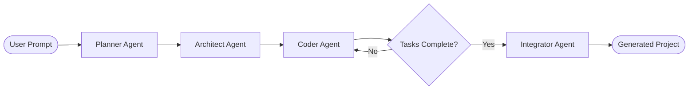

# Adra-AI

A multi-agent coding assistant that turns a natural-language project prompt into a working codebase. Built with [LangGraph](https://langchain-ai.github.io/langgraph/) and LangChain, Adra-AI runs a four-stage pipeline—**Planner → Architect → Coder → Integrator**—to plan, decompose, implement, and cross-check software projects step by step.

## How it works



1. **Planner** — Converts your prompt into a structured project plan: app name, description, tech stack, features, and target files.
2. **Architect** — Breaks the plan into ordered implementation steps, each with a file path and detailed task description. One step per file, ordered by dependency.
3. **Coder** — Executes one step at a time using file tools (`read_file`, `write_file`) to create and update code in `generated_project/`. Each step receives context from already-written sibling files so imports, exports, and APIs stay aligned as the project grows.
4. **Integrator** — After all coder steps finish, reads the full project and fixes cross-file issues: missing exports, mismatched imports, wrong paths, and logic bugs that block end-to-end behavior. Only files that need correction are rewritten.

The coder loops until every architect step is complete, then the integrator runs once before the pipeline finishes.

## Features

- **Structured planning** — Pydantic schemas enforce consistent plans, task breakdowns, and integration results.
- **Step-by-step implementation** — Each file is built in dependency order with live context from prior files.
- **Cross-file integration pass** — The integrator agent reviews the whole codebase and patches integration bugs the coder may have missed.
- **Sandboxed file I/O** — All writes are confined to `generated_project/` for safety.
- **Centralized LLM client** — Throttled API calls, automatic retries on rate limits, and context truncation live in `agent/llm_client.py`.
- **Pluggable LLM backend** — Swap between Google Gemini and Groq models via a one-line change in `agent/llm_client.py`.

## Tech stack

| Layer | Tools |
|-------|-------|
| Orchestration | LangGraph, LangChain |
| LLM (default) | Groq (`openai/gpt-oss-120b`) |
| LLM (optional) | Google Gemini 2.5 Flash |
| Schemas | Pydantic v2 |
| Runtime | Python 3.12+ |

## Prerequisites

- Python **3.12+**
- An API key for your chosen LLM provider:
  - **Groq** (default): [Groq Console](https://console.groq.com/)
  - **Google Gemini** (optional): [Google AI Studio](https://aistudio.google.com/apikey)

## Installation

### Option A — uv (recommended)

Install [uv](https://docs.astral.sh/uv/) first, then:

```powershell
git clone https://github.com/adityaxxz/Adra-AI.git
cd Adra-AI

uv venv
.\.venv\Scripts\Activate.ps1

uv sync
```

## Configuration

Copy the example env file and add your API key:

```powershell
Copy-Item .env.example .env
```

Edit `.env` and set the key for your provider:

```env
# Default (Groq)
GROQ_API_KEY="your-groq-api-key"

# Optional — if using Gemini instead (see agent/llm_client.py)
# GOOGLE_API_KEY="your-google-api-key"
```

Optional LLM tuning (defaults shown):

```env
LLM_MIN_INTERVAL_SEC=2.1    # Minimum seconds between API calls
LLM_MAX_RETRIES=5           # Retries on rate-limit errors
LLM_MAX_CONTENT_CHARS=10000 # Context truncation limit per file
```

To switch to Gemini, uncomment the `ChatGoogleGenerativeAI` line and comment out the `ChatGroq` line in `agent/llm_client.py`.

## Usage

Run the CLI and enter a project description when prompted:

```powershell
python main.py
```

Example prompts:

```text
Create a simple to-do list web application using HTML, CSS, and JavaScript
Create a simple calculator web application.
Create a simple blog API in FastAPI with a SQLite database.
Create a tic-tac-toe game with HTML, CSS, and JavaScript.
```

Optional flags:

```powershell
python main.py --recursion-limit 100
python main.py -r 150
```

On completion, the CLI reports total LLM API calls and how many files the integrator corrected (if any).

Generated files are written to **`generated_project/`**. Open the output (e.g. `index.html`) in a browser or run any backend commands described in the generated README or requirements.

## Project structure

```text
Adra-AI/
├── main.py                 # CLI entry point
├── agent/
│   ├── graph.py            # LangGraph pipeline (planner → architect → coder → integrator)
│   ├── llm_client.py       # LLM setup, throttling, retries, structured output
│   ├── state.py            # Pydantic models (Plan, TaskPlan, CoderState, IntegrationResult)
│   ├── prompts.py          # System prompts for each agent
│   └── tools.py            # File I/O tools (scoped to generated_project/)
├── generated_project/      # Output directory (created at runtime)
├── projects using integrator node/   # Sample outputs from test runs
├── pyproject.toml
├── requirements.txt
└── .env.example
```

## Example workflow

```powershell
# 1. Install dependencies
uv sync

# 2. Configure API key
Copy-Item .env.example .env
# Edit .env and set GROQ_API_KEY

# 3. Run the agent
python main.py

# 4. Enter your prompt, then inspect generated_project/
```

## Sample generated projects

The `projects using integrator node/` folder contains example outputs from Adra-AI runs with the integrator enabled:

| Folder | Description |
|--------|-------------|
| `generated_project_tic_tac_toe/` | Browser tic-tac-toe game (HTML, CSS, JS) |
| `generated_project_blog_api_using_fastapi_and_sqlite/` | FastAPI blog API scaffold |
| `generated_project/` | Full FastAPI + SQLite CRUD app (models, schemas, routes) |
| `generated_project_1/` | To-do list web app (HTML, CSS, JS) |

These are reference outputs — new runs always write to `generated_project/` at the repo root.

## Switching LLM providers

In `agent/llm_client.py`, choose one provider:

```python
# Default
llm = ChatGroq(model="openai/gpt-oss-120b", temperature=0)

# Gemini alternative
# llm = ChatGoogleGenerativeAI(model="gemini-2.5-flash", temperature=0)
```

## Agent details

### Coder integration context

While implementing each file, the coder receives the contents of all other already-written project files. Prompts enforce that imports, module names, and public APIs must match what exists in the codebase — reducing drift between files during the build phase.

### Integrator review

The integrator reads every file in `generated_project/` and checks for:

- References to symbols or modules that do not exist
- Missing exports that dependent files expect
- Mismatched names (imports vs exports, config keys, constants)
- Wrong file or module paths
- Logic bugs that prevent core features from working end-to-end

It returns a list of file updates (full corrected content per file). If everything integrates cleanly, no files are changed.
