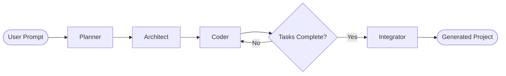
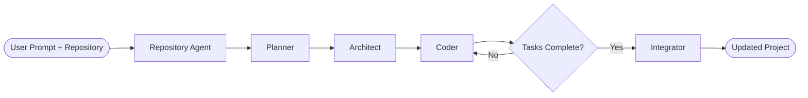

# Adra-AI

A multi-agent coding assistant that turns natural-language prompts into working codebases or edits existing repositories. Built with [LangGraph](https://langchain-ai.github.io/langgraph/) and LangChain, Adra-AI operates in three modes:

1. **Project Generation** — Creates new projects from scratch using a four-stage pipeline: Planner → Architect → Coder → Integrator
2. **Repository-Aware Editing** — Edits existing repositories with context-aware RAG (Retrieval-Augmented Generation)
3. **Question Answering** — Asks questions about codebases without making changes

## How it works

### Project Generation Mode (default)



1. **Planner** — Converts your prompt into a structured project plan: app name, description, tech stack, features, and target files.
2. **Architect** — Breaks the plan into ordered implementation steps, each with a file path and detailed task description. One step per file, ordered by dependency.
3. **Coder** — Executes one step at a time using file tools (`read_file`, `write_file`) to create and update code in `generated_project/`. Each step receives context from already-written sibling files so imports, exports, and APIs stay aligned as the project grows.
4. **Integrator** — After all coder steps finish, reads the full project and fixes cross-file issues: missing exports, mismatched imports, wrong paths, and logic bugs that block end-to-end behavior. Only files that need correction are rewritten.

The coder loops until every architect step is complete, then the integrator runs once before the pipeline finishes.

### Repository-Aware Editing Mode



1. **Repository Agent** — Scans, chunks, and indexes the repository into ChromaDB vector store; retrieves relevant code snippets via semantic search
2. **Planner** — Creates project plan using repository context to prefer modifying existing files over creating duplicate functionality
3. **Architect** — Breaks the plan into implementation steps with awareness of existing codebase structure
4. **Coder** — Implements changes using both project context and repository-specific code snippets
5. **Integrator** — Reviews and fixes cross-file integration issues in the updated codebase

### Question Answering Mode


1. **Repository Agent** — Retrieves relevant code snippets from the indexed repository based on the question
2. **Explainer Agent** — Analyzes the retrieved context and provides accurate answers about the codebase without making changes

## Features

### Core Features
- **Structured planning** — Pydantic schemas enforce consistent plans, task breakdowns, and integration results
- **Step-by-step implementation** — Each file is built in dependency order with live context from prior files
- **Cross-file integration pass** — The integrator agent reviews the whole codebase and patches integration bugs the coder may have missed
- **Sandboxed file I/O** — All writes are confined to `generated_project/` for safety
- **Centralized LLM client** — Throttled API calls, automatic retries on rate limits, and context truncation live in `agent/llm_client.py`
- **Pluggable LLM backend** — Swap between Google Gemini and Groq models via a one-line change in `agent/llm_client.py`

### Repository-Aware Features
- **Repository scanning** — Automatically scans repositories for supported file types (Python, JavaScript, TypeScript, HTML, CSS, Markdown, JSON)
- **Intelligent chunking** — Splits code into semantic chunks with overlap for better context preservation
- **Embedding generation** — Generates vector embeddings for semantic search
- **Vector store** — ChromaDB-backed persistent storage for code chunks and embeddings
- **Semantic search** — Retrieves relevant code snippets based on natural language queries
- **GitHub integration** — Clone and index GitHub repositories automatically
- **Context-aware planning** — Leverages existing code patterns and structure when planning changes
- **Collection management** — Support for multiple repository collections with custom naming

## Tech stack

| Layer | Tools |
|-------|-------|
| Orchestration | LangGraph, LangChain |
| LLM (default) | Groq (`openai/gpt-oss-120b`) |
| LLM (optional) | Google Gemini 2.5 Flash |
| Vector Store | ChromaDB |
| Embeddings | LangChain Embeddings |
| Schemas | Pydantic v2 |
| Runtime | Python 3.12+ |

## Prerequisites

- Python **3.12+**
- An API key for your chosen LLM provider:
  - **Groq** (default): [Groq Console](https://console.groq.com/)
  - **Google Gemini** (optional): [Google AI Studio](https://aistudio.google.com/apikey)
- Git (for GitHub repository cloning)

## Installation

### Option A — uv (recommended)

Install [uv](https://docs.astral.sh/uv/) first, then:

```powershell
git clone https://github.com/adityaxxz/Adra-AI.git
cd Adra-AI

uv venv
.\.venv\Scripts\Activate.ps1

uv sync
```

### Option B — pip

```powershell
git clone https://github.com/adityaxxz/Adra-AI.git
cd Adra-AI

python -m venv .venv
.\.venv\Scripts\Activate.ps1

pip install -r requirements.txt
```

## Configuration

Copy the example env file and add your API key:

```powershell
Copy-Item .env.example .env
```

Edit `.env` and set the key for your provider:

```env
# Default (Groq)
GROQ_API_KEY="your-groq-api-key"

# Optional — if using Gemini instead (see agent/llm_client.py)
# GOOGLE_API_KEY="your-google-api-key"
```

Optional LLM tuning (defaults shown):

```env
LLM_MIN_INTERVAL_SEC=2.1    # Minimum seconds between API calls
LLM_MAX_RETRIES=5           # Retries on rate-limit errors
LLM_MAX_CONTENT_CHARS=10000 # Context truncation limit per file
```

To switch to Gemini, uncomment the `ChatGoogleGenerativeAI` line and comment out the `ChatGroq` line in `agent/llm_client.py`.

## Usage

### Project Generation Mode (default)

Run the CLI and enter a project description when prompted:

```powershell
python main.py
```

Example prompts:

```text
Create a simple to-do list web application using HTML, CSS, and JavaScript
Create a simple calculator web application.
Create a simple blog API in FastAPI with a SQLite database.
Create a tic-tac-toe game with HTML, CSS, and JavaScript.
```

Optional flags:

```powershell
python main.py --recursion-limit 100
python main.py -r 150
```

On completion, the CLI reports total LLM API calls and how many files the integrator corrected (if any).

Generated files are written to **`generated_project/`**. Open the output (e.g. `index.html`) in a browser or run any backend commands described in the generated README or requirements.

### Repository-Aware Editing Mode

Edit an existing local repository:

```powershell
python main.py --repo /path/to/your/repository
```

Clone and edit a GitHub repository:

```powershell
python main.py --github https://github.com/username/repository
```

Specify a custom collection name for the vector store:

```powershell
python main.py --repo /path/to/repo --collection my-custom-collection
```

Example prompts for repository editing:

```text
Add user authentication to this FastAPI application
Add error handling to all API endpoints
Refactor the database layer to use async operations
Add unit tests for the user service module
```

The system will:
1. Index the repository (if not already indexed)
2. Retrieve relevant code snippets based on your request
3. Plan changes that respect existing code patterns
4. Implement the modifications
5. Run integration checks

### Question Answering Mode

Ask questions about a codebase without making changes:

```powershell
python main.py --repo /path/to/repository --ask
python main.py --github https://github.com/username/repository --ask
```

Example questions:

```text
How does the authentication system work in this codebase?
What is the purpose of the UserService class?
How are database connections managed in this application?
Explain the routing structure of this API
```

The system will:
1. Index the repository (if not already indexed)
2. Retrieve relevant code snippets based on your question
3. Provide a detailed answer with code references

## Project structure

```text
Adra-AI/
├── main.py                          # CLI entry point
├── agent/
│   ├── graph.py                     # LangGraph pipelines for all three modes
│   ├── llm_client.py                # LLM setup, throttling, retries, structured output
│   ├── state.py                     # Pydantic models (Plan, TaskPlan, CoderState, IntegrationResult)
│   ├── prompts.py                   # System prompts for each agent
│   ├── tools.py                     # File I/O tools (scoped to generated_project/)
│   └── repository/                  # Repository-aware RAG module
│       ├── scanner.py               # Repository file scanning
│       ├── chunker.py               # Code chunking for embeddings
│       ├── embeddings.py            # Embedding generation
│       ├── vector_store.py         # ChromaDB integration
│       ├── retriever.py            # Semantic search
│       ├── service.py               # Repository indexing and search API
│       └── models.py                # Repository-related Pydantic models
├── generated_project/               # Output directory (created at runtime)
├── temp_repos/                      # Cloned GitHub repositories
├── chroma_db/                       # Vector store persistence
├── projects using integrator node/  # Sample outputs from test runs
├── pyproject.toml
├── requirements.txt
└── .env.example
```

## Example workflows

### Project Generation

```powershell
# 1. Install dependencies
uv sync

# 2. Configure API key
Copy-Item .env.example .env
# Edit .env and set GROQ_API_KEY

# 3. Run the agent
python main.py

# 4. Enter your prompt, then inspect generated_project/
```

### Repository Editing

```powershell
# 1. Index a local repository
python main.py --repo /path/to/your/project

# 2. Enter your modification request
# e.g., "Add error handling to all database operations"

# 3. Review the changes in the repository
```

### GitHub Repository Analysis

```powershell
# 1. Clone and analyze a GitHub repository
python main.py --github https://github.com/username/repo --ask

# 2. Enter your question
# e.g., "How is authentication implemented in this project?"

# 3. Receive detailed explanation with code references
```

## Sample generated projects

The `projects using integrator node/` folder contains example outputs from Adra-AI runs with the integrator enabled:

| Folder | Description |
|--------|-------------|
| `generated_project_tic_tac_toe/` | Browser tic-tac-toe game (HTML, CSS, JS) |
| `generated_project_blog_api_using_fastapi_and_sqlite/` | FastAPI blog API scaffold |
| `generated_project/` | Full FastAPI + SQLite CRUD app (models, schemas, routes) |
| `generated_project_1/` | To-do list web app (HTML, CSS, JS) |

These are reference outputs — new runs always write to `generated_project/` at the repo root for project generation mode, or modify files in-place for repository editing mode.

## Switching LLM providers

In `agent/llm_client.py`, choose one provider:

```python
# Default
llm = ChatGroq(model="openai/gpt-oss-120b", temperature=0)

# Gemini alternative
# llm = ChatGoogleGenerativeAI(model="gemini-2.5-flash", temperature=0)
```

## Agent details

### Project Generation Agents

#### Planner
Converts user prompts into structured project plans with app name, description, tech stack, features, and target files.

#### Architect
Breaks down the plan into ordered implementation steps, each with a file path and detailed task description. Maintains dependency ordering and specifies what each file must expose and consume.

#### Coder
Executes one step at a time, creating or modifying files with awareness of already-written sibling files. Ensures imports, exports, and APIs align across the growing codebase.

#### Integrator
Reviews the complete project after all steps are done, detecting and fixing cross-file integration issues like missing exports, mismatched imports, wrong paths, and logic bugs.

### Repository-Aware Agents

#### Repository Agent
Scans repositories for supported file types, chunks code into semantic segments, generates embeddings, and stores them in ChromaDB. Retrieves relevant code snippets via semantic search based on user queries.

#### Explainer Agent
Analyzes retrieved repository context to answer user questions about codebases without making any changes. Provides explanations of how features work, references specific files and code snippets.

### Coder integration context

While implementing each file, the coder receives:
- Contents of all other already-written project files
- File-specific relevant code snippets from the repository (in repository editing mode)
- Repository context for understanding existing patterns and conventions

Prompts enforce that imports, module names, and public APIs must match what exists in the codebase — reducing drift between files during the build phase.

### Integrator review

The integrator reads every file in `generated_project/` (or the target repository) and checks for:

- References to symbols or modules that do not exist
- Missing exports or public interfaces that dependent files expect to call or import
- Mismatched names between files (imports vs exports, config keys, shared constants)
- Wrong file paths, module paths, or resource references
- Logic bugs that prevent core features from working end-to-end

It returns a list of file updates (full corrected content per file). If everything integrates correctly, no files are changed.

### Repository indexing

The repository indexing process:
1. **Scanning** — Walks the repository tree, filtering by supported extensions and ignoring common directories (.git, node_modules, etc.)
2. **Chunking** — Splits file contents into overlapping chunks (1000 characters with 200 overlap) for better context preservation
3. **Embedding** — Generates vector embeddings for each chunk using the configured embedding model
4. **Storage** — Stores chunks and embeddings in ChromaDB with metadata (file path, language, line numbers)
5. **Retrieval** — Performs semantic search to find the most relevant chunks for a given query

## Supported file types

- Python (`.py`)
- JavaScript (`.js`, `.jsx`)
- TypeScript (`.ts`, `.tsx`)
- HTML (`.html`)
- CSS (`.css`)
- Markdown (`.md`)
- JSON (`.json`)

Additional file types can be added by modifying the `SUPPORTED_EXTENSIONS` dictionary in `agent/repository/scanner.py`.

## Collection management

ChromaDB collections allow you to maintain separate indexes for different repositories:

- Each repository can have its own collection
- Collections are automatically named based on the repository name
- Custom collection names can be specified with the `--collection` flag
- Collections persist in the `chroma_db/` directory

This enables working with multiple repositories without cross-contamination of search results.

## Troubleshooting

### Rate limiting
If you encounter rate limit errors, increase `LLM_MIN_INTERVAL_SEC` in your `.env` file to add more delay between API calls.

### Context truncation
If the LLM is missing important context, increase `LLM_MAX_CONTENT_CHARS` to allow more context per file.

### Repository indexing issues
If a repository fails to index:
- Check that the repository path is correct
- Ensure the repository contains supported file types
- Verify you have read permissions for the repository
- Try clearing the collection: `python -c "from agent.repository.vector_store import clear_collection; clear_collection('collection_name')"`

### Memory issues
For large repositories, consider:
- Increasing the chunk size in `agent/repository/chunker.py`
- Limiting the number of files scanned
- Using a machine with more RAM

## License

MIT License - feel free to use this project for your own purposes.
