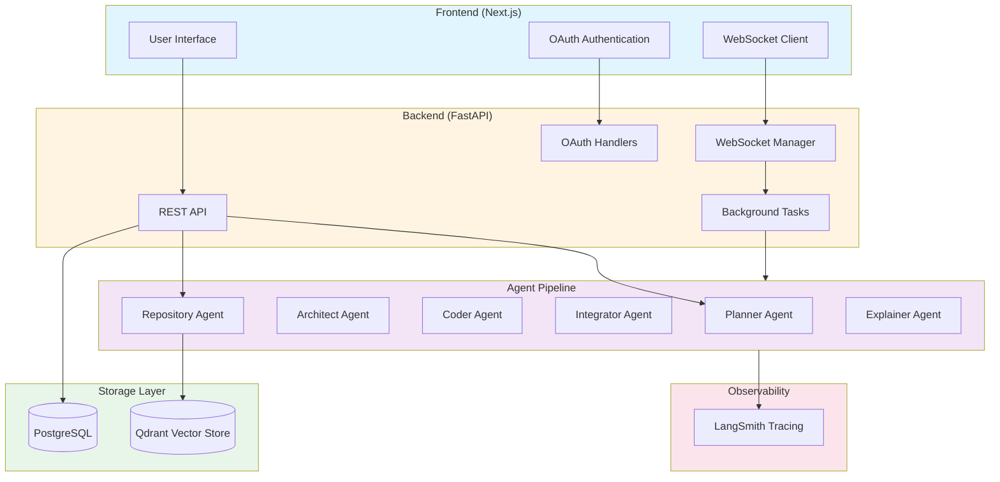
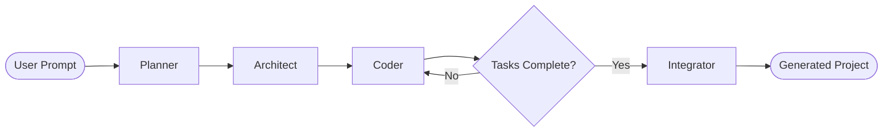
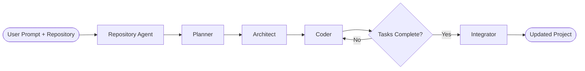
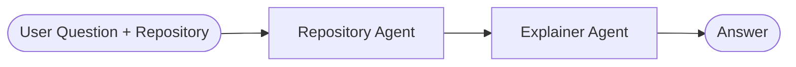

# Adra-AI

[](https://adra-ai.vercel.app)
[](https://smith.langchain.com)
[](https://langchain-ai.github.io/langgraph/)
[](https://fastapi.tiangolo.com/)

A multi-agent Codebase Intelligence platform that turns natural-language prompts into working codebases or edits existing repositories. Built with [LangGraph](https://langchain-ai.github.io/langgraph/) and LangChain, Adra-AI features a modern web application with real-time updates and operates in a dual-graph workflow architecture:

1. **Project Generation** — Creates new projects from scratch using a four-stage pipeline (Planner → Architect → Coder → Integrator) without repository context.
2. **Repository-Aware Editing** — Edits existing repositories using a repository-aware graph (Repository Agent → Planner → Architect → Coder → Integrator) backed by context-aware RAG.
3. **Question Answering** — Asks questions about codebases without making changes using specialized explainer agents.

## Architecture

Adra-AI now features a full SaaS architecture with:

- **Backend**: FastAPI with PostgreSQL database and Qdrant vector store
- **Frontend**: Next.js with React, TypeScript, and Tailwind CSS
- **Authentication**: OAuth 2.0 (Google & GitHub)
- **Real-time Updates**: WebSocket support for live progress tracking
- **Observability**: LangSmith tracing for end-to-end agent pipeline visibility
- **Deployment**: Docker Compose setup for easy deployment

### Architecture Diagram


```mermaid
flowchart TB
    subgraph Frontend["Frontend (Next.js)"]
        UI[User Interface]
        Auth[OAuth Authentication]
        WS[WebSocket Client]
    end
    
    subgraph Backend["Backend (FastAPI)"]
        API[REST API]
        OAuth[OAuth Handlers]
        WSManager[WebSocket Manager]
        BGTasks[Background Tasks]
    end
    
    subgraph Storage["Storage Layer"]
        PG[(PostgreSQL)]
        Qdrant[(Qdrant Vector Store)]
    end
    
    subgraph Agents["Agent Pipeline"]
        Planner[Planner Agent]
        Architect[Architect Agent]
        Coder[Coder Agent]
        Integrator[Integrator Agent]
        RepoAgent[Repository Agent]
        Explainer[Explainer Agent]
    end

    subgraph Observability["Observability"]
        LS[LangSmith Tracing]
    end
    
    UI --> API
    Auth --> OAuth
    WS --> WSManager
    API --> Planner
    API --> RepoAgent
    WSManager --> BGTasks
    BGTasks --> Agents
    API --> PG
    RepoAgent --> Qdrant
    Agents --> LS
    
    style Frontend fill:#e1f5ff
    style Backend fill:#fff4e1
    style Storage fill:#e8f5e9
    style Agents fill:#f3e5f5
    style Observability fill:#fce4ec
```

## How it works

### Project Generation Mode


```mermaid
flowchart LR

    A([User Prompt])
    B[Planner]
    C[Architect]
    D[Coder]
    E{Tasks Complete?}
    F[Integrator]
    G([Generated Project])

    A --> B
    B --> C
    C --> D
    D --> E

    E -->|No| D
    E -->|Yes| F

    F --> G
```

1. **Planner** — Converts your prompt into a structured project plan: app name, description, tech stack, features, and target files.
2. **Architect** — Breaks the plan into ordered implementation steps, each with a file path and detailed task description. One step per file, ordered by dependency.
3. **Coder** — Executes one step at a time using file tools (`read_file`, `write_file`) to create and update code. Each step receives context from already-written sibling files so imports, exports, and APIs stay aligned as the project grows.
4. **Integrator** — After all coder steps finish, reads the full project and fixes cross-file issues: missing exports, mismatched imports, wrong paths, and logic bugs that block end-to-end behavior. Only files that need correction are rewritten.

### Repository-Aware Editing Mode


```mermaid
flowchart LR

    A([User Prompt + Repository])
    B[Repository Agent]
    C[Planner]
    D[Architect]
    E[Coder]
    F{Tasks Complete?}
    G[Integrator]
    H([Updated Project])

    A --> B
    B --> C
    C --> D
    D --> E
    E --> F

    F -->|No| E
    F -->|Yes| G

    G --> H
```

1. **Repository Agent** — Scans, chunks, and indexes the repository into Qdrant vector store; retrieves relevant code snippets via semantic search
2. **Planner** — Creates project plan using repository context to prefer modifying existing files over creating duplicate functionality
3. **Architect** — Breaks the plan into implementation steps with awareness of existing codebase structure
4. **Coder** — Implements changes using both project context and repository-specific code snippets
5. **Integrator** — Reviews and fixes cross-file integration issues in the updated codebase

### Question Answering Mode


```mermaid
flowchart LR

    A([User Question + Repository])
    B[Repository Agent]
    C[Explainer Agent]
    D([Answer])

    A --> B
    B --> C
    C --> D
```

1. **Repository Agent** — Retrieves relevant code snippets from the indexed repository based on the question
2. **Explainer Agent** — Analyzes the retrieved context and provides accurate answers about the codebase without making changes

## Features

### Core Features
- **Dual-Graph Workflow Architecture** — Multi-agent system separating scratch project generation from repository-aware editing to reduce execution complexity
- **Pydantic-Enforced Structured Outputs** — Every agent uses `llm.with_structured_output(schema, method="json_schema")` to guarantee type-safe, schema-validated LLM responses, eliminating hallucinated or malformed outputs from reaching file I/O
- **Structured planning** — Pydantic schemas enforcing consistent plans, task breakdowns, and validation
- **Step-by-step implementation** — Builds each file in dependency order with live context from prior files
- **Cross-file integration pass** — Post-coder optimization to resolve cross-file import, export, and route mismatch bugs
- **Context & Token Management** — Smart context truncation (4,000 chars for repo context, 8,000 chars for project context) to prevent token overflow
- **Throttling & Fault Tolerance** — Custom rate limiting (2.1s minimum interval) with exponential back-off and 5x retries to prevent API resource exhaustion
- **Iterative Loop Limits** — Caps recursion depth at 100 steps to prevent infinite execution loops during agent runs
- **Pluggable LLM backend** — Swap between Google Gemini, Groq, and NVIDIA NIM models via a single `LLM_PROVIDER` environment variable
- **Sandboxed File I/O** — All agent file operations are path-validated within a configurable project root to prevent directory traversal

### Observability & Debugging
- **LangSmith Integration** — Full end-to-end tracing of every LLM call, agent node transition, tool invocation, and graph traversal across all three pipeline modes. Enables real-time debugging, latency profiling, token usage analysis, and run replay directly from the LangSmith dashboard
- **OpenTelemetry Support** — Distributed tracing across the FastAPI backend and agent pipeline using `opentelemetry-sdk` and `opentelemetry-exporter-otlp-proto-grpc` for production observability
- **Structured Logging** — Centralized `logging` module across all backend modules with standardized JSON error response shapes via `error_handlers.py`

### Repository-Aware Features
- **Repository scanning** — Automatically scans repositories for supported file types (Python, JavaScript, TypeScript, HTML, CSS, Markdown, JSON)
- **Structure-Aware Code Chunking** — Custom syntax-aware chunker supporting 9 file extensions / 7 core programming languages (AST-based for Python, regex for JS/TS)
- **Whole-file Fallback Chunks** — Files ≤80 lines always receive an additional whole-file chunk to guarantee complete content retrieval for small modules
- **SHA256 Incremental Indexing** — File hashing pipeline to only re-index new/modified files, optimizing performance and vector store writes
- **Cost-Optimized Vector Operations** — Avoids duplicate embedding API calls, saving over 90% in costs and time on routine updates
- **Garbage Collection** — Background tasks to remove orphaned code chunks when files are deleted from the codebase using symmetric-difference comparison
- **Google Gemini Embeddings** — Uses `models/gemini-embedding-001` via `GoogleGenerativeAIEmbeddings` for high-quality dense vector representations of code
- **Deterministic Chunk IDs** — UUID5-based deterministic point IDs ensure idempotent upserts, preventing duplicate vectors on repeated indexing
- **Embedding generation** — Generates vector embeddings for semantic search
- **Vector store** — Qdrant-backed persistent storage for code chunks and embeddings with payload indexing on `file_path` for fast filtered deletions
- **Semantic search** — Retrieves relevant code snippets based on natural language queries
- **GitHub integration** — Clone and index GitHub repositories automatically
- **Context-aware planning** — Leverages existing code patterns and structure when planning changes

### SaaS Platform Features
- **OAuth authentication** — Secure sign-in with Google and GitHub; JWTs signed with HS256 via `python-jose` with 24-hour expiry
- **User management** — Multi-tenant support with user-specific projects and repositories; role-based access (`UserRole.USER` / `UserRole.ADMIN`)
- **Admin bypass** — Configurable `ADMIN_EMAILS` list to exempt specific accounts from usage quotas
- **Project management** — Create, view, and manage generated projects; files stored as structured JSON in PostgreSQL
- **Repository management** — Connect and index multiple repositories
- **Real-time updates** — WebSocket-based progress tracking for long-running tasks with per-session connection pooling
- **Background processing** — Async task processing via `ThreadPoolExecutor` bridging the async FastAPI event loop with synchronous LangGraph agents
- **Async Database** — SQLAlchemy 2.0 async ORM with `asyncpg` driver and proper session lifecycle management
- **Rate limiting** — Configurable rate limits for API endpoints (auth: 5/min, generation: 2/hr, general API: 60/min)
- **Error handling** — Comprehensive error handling and logging with standardized JSON error responses for HTTP, validation, SQLAlchemy, and generic exceptions

## Tech Stack

| Layer | Tools |
|-------|-------|
| Frontend | Next.js 14, React 18, TypeScript, Tailwind CSS |
| Backend | FastAPI, Python 3.12+, SQLAlchemy 2.0 (async) |
| Database | PostgreSQL 16 + asyncpg |
| Vector Store | Qdrant 1.12.0 (Cloud) |
| Orchestration | LangGraph 1.2, LangChain |
| LLM (default) | Google Gemini 2.5 Flash |
| LLM (optional) | Groq (`openai/gpt-oss-120b`), NVIDIA NIM (`meta/llama-3.1-8b-instruct`) |
| Embeddings | Google Gemini Embedding (`models/gemini-embedding-001`) |
| Observability | LangSmith (tracing & debugging), OpenTelemetry (OTLP/gRPC) |
| Authentication | OAuth 2.0 (Google, GitHub), JWT (HS256 via python-jose) |
| Real-time | WebSockets |
| Deployment | Docker, Docker Compose, Nginx, Certbot/Let's Encrypt |
| State Management | Zustand |
| Data Fetching | TanStack Query |
| Migrations | Alembic |

## Prerequisites

- Docker and Docker Compose
- OAuth credentials (Google and/or GitHub)
- LLM API keys (Google Gemini, Groq, or other supported providers)
- (Optional) LangSmith API key for tracing and observability

## Installation

### Option A — Docker Deployment (Recommended for Web App)

1. Clone the repository:
```bash
git clone https://github.com/adityaxxz/Adra-AI.git
cd Adra-AI
```

2. Configure environment variables:
```bash
cp .env.example .env
```

Open `.env` and fill in your credentials. Refer to [.env.example](.env.example) for descriptions of each environment variable.

3. Start all services:
```bash
docker-compose up -d
```

4. Access the application:
- Frontend: http://localhost:3000
- Backend API: http://localhost:8000
- API Documentation: http://localhost:8000/docs

## Usage

### Web Application
1. **Authenticate**: Sign in with Google or GitHub OAuth.
2. **Create Project**: Use the UI to generate new projects.
3. **Connect Repository**: Add and index repositories for editing or Q&A.
4. **Track Progress**: Follow real-time generation logs via WebSockets.

### CLI Usage
For running Adra-AI locally via the command-line interface without the web application, see the [CLI Usage Guide](cli_usage.md).

## OAuth Setup

To configure authentication:
1. **Google OAuth**: Generate credentials in the [Google Cloud Console](https://console.cloud.google.com/).
2. **GitHub OAuth**: Create a new OAuth App in GitHub Developer settings.
3. Configure the redirect URIs in your developer console:
   - Local development: `http://localhost:3000/auth/[google|github]/callback`
   - Production: `https://adra-ai.vercel.app/auth/[google|github]/callback`
4. Add the generated credentials to your `.env` file.

## LangSmith Observability

Adra-AI integrates [LangSmith](https://smith.langchain.com) for full end-to-end tracing, debugging, and observability across the entire agentic pipeline.

When enabled, LangSmith automatically captures every step of agent execution:
- **LLM calls** — inputs, outputs, token counts, and latency for every Gemini/Groq/NVIDIA invocation
- **Agent node transitions** — full trace of Planner → Architect → Coder → Integrator graph traversal
- **Tool invocations** — `read_file`, `write_file` calls made by each agent node
- **Structured output parsing** — validation attempts and schema enforcement for each Pydantic model
- **Semantic search queries** — repository context retrieved from Qdrant per agent step
- **Retry attempts** — visibility into rate-limit hits and exponential back-off retries

To enable LangSmith tracing, add the following to your `.env`:

```env
LANGSMITH_TRACING_V2=true
LANGSMITH_ENDPOINT=https://api.smith.langchain.com
LANGSMITH_API_KEY=your-langsmith-api-key
LANGSMITH_PROJECT=Adra AI
```

No code changes are required — LangChain and LangGraph automatically pick up these environment variables and route all traces to your LangSmith project dashboard.

## Advanced Repository Features

### Structure-Aware Code Chunking
Replaced naive character-based text splitting with a custom syntax-aware chunker supporting 9 file extensions / 7 core programming languages (`.py`, `.js`, `.ts`, `.tsx`, `.jsx`, `.html`, `.css`, `.md`, `.json`):
- **Python**: AST-based parsing to extract imports, classes, functions, and modules.
- **JavaScript/TypeScript/React**: Parses variables, arrow functions, methods, and classes using custom brace-matching algorithms and regular expressions.
- **HTML**: Isolates structure by head, body, script, style, and section tags.
- **CSS**: Chunks at the rule level (selectors and at-rules).
- **Markdown**: Section-based chunking by headers.
- **JSON**: Parser targeting top-level keys.
- **Generic**: Recursive character splitting with overlap for other files.
- **Whole-file Chunks**: Files ≤80 lines receive an additional whole-file chunk to guarantee full-content retrieval for small modules.

### Cost-Optimized Incremental Indexing
- **SHA256 Incremental Indexing**: Files are hashed using SHA256 to detect local changes.
- **90%+ Cost Reduction**: By comparing live file hashes against stored vector metadata, unchanged files are completely skipped. This avoids redundant embedding API calls, reducing embedding costs and repository indexing time by over 90% on routine updates.
- **Garbage Collection of Deleted Code**: Background tasks calculate symmetric differences between directories and vector indexes, executing deletions for orphaned vectors to maintain database hygiene.
- **Idempotent Upserts**: UUID5-based deterministic point IDs prevent duplicate vectors on repeated indexing runs.

### Pydantic-Enforced Structured Agent Outputs
Every agent uses `llm.with_structured_output(schema, method="json_schema")` to enforce type-safe responses:
- `Plan` — Validates app name, description, tech stack, features, and file list
- `TaskPlan` — Validates ordered implementation steps with file paths and task descriptions
- `CoderOutput` — Validates complete file content returned by the Coder agent
- `IntegrationResult` — Validates a list of `FileUpdate` objects for cross-file integration fixes

This prevents hallucinated or malformed responses from reaching file I/O operations.

## API Documentation

Once the backend is running, the interactive Swagger UI API documentation is available at `http://localhost:8000/docs`.

Key endpoints include:
- `POST /projects` - Create a new project
- `POST /repositories/{id}/index` - Index a repository
- `WS /ws/{session_id}` - WebSocket for real-time progress updates

## 🚀 Deployment 

### Live Production Architecture
The live project is fully deployed and configured using:
* **Frontend**: Deployed on [Vercel](https://vercel.com) (Next.js serverless app).
* **Backend**: Hosted on a [DigitalOcean Droplet](https://digitalocean.com) in the Bangalore (`blr1`) region, running:
  - **Docker Compose** container network (FastAPI API, PostgreSQL, Qdrant).
  - **Nginx** reverse proxy routing requests and handling WebSockets.
  - **Certbot / Let's Encrypt** for automated SSL/HTTPS.

## Development

### Backend Development

```bash
cd backend
pip install -r requirements.txt
uvicorn main:app --host 0.0.0.0 --port 8000 --reload
```

### Frontend Development

```bash
cd frontend
npm install
npm run dev
```

### Running Tests

```bash
# Backend tests
cd backend
pytest

# Frontend tests
cd frontend
npm test
```

## Project Structure

```
Adra-AI/
├── agent/                 # Agent pipeline implementation
│   ├── graph.py          # LangGraph orchestration (3 compiled graphs)
│   ├── llm_client.py     # LLM client with throttling, retries & multi-provider support
│   ├── prompts.py        # Agent prompt templates (Planner, Architect, Coder, Integrator, Explainer)
│   ├── state.py          # Pydantic state schemas for type-safe agent I/O
│   ├── tools.py          # Sandboxed file I/O tools (read_file, write_file, run_cmd)
│   └── repository/       # Repository-aware RAG pipeline
│       ├── code_aware_chunker.py  # AST/regex syntax-aware chunker (9 extensions)
│       ├── embeddings.py          # Google Gemini embedding wrapper with retry handling
│       ├── file_hash.py           # SHA256 file hashing for incremental indexing
│       ├── models.py              # CodeChunk and IndexingStats Pydantic models
│       ├── retriever.py           # Qdrant semantic search retriever
│       ├── scanner.py             # Repository file scanner (7 languages)
│       ├── service.py             # Orchestration: index, search, clone GitHub repos
│       └── vector_store.py       # Qdrant client: upsert, delete, scroll, payload index
├── backend/              # FastAPI backend
│   ├── main.py           # REST API endpoints + lifespan management
│   ├── auth.py           # OAuth 2.0 handlers + JWT (HS256) authentication
│   ├── db_models.py      # SQLAlchemy ORM models (User, Project, Repository, Session)
│   ├── agent_integration.py  # Bridge layer: agents ↔ database
│   ├── websocket_manager.py  # WebSocket connection manager + ProgressReporter
│   ├── background_tasks.py   # Async task executor (ThreadPoolExecutor bridge)
│   ├── error_handlers.py     # Centralized error handling middleware
│   └── rate_limit.py         # slowapi rate limiter configuration
├── frontend/             # Next.js frontend
│   ├── app/
│   ├── components/
│   ├── api-client.ts
│   └── websocket-hook.ts
├── docker-compose.yml    # Docker services
├── main.py              # CLI entry point
└── requirements.txt     # Python dependencies
```

## Troubleshooting

### Docker Issues
```bash
# Check container status
docker-compose ps

# View logs
docker-compose logs -f

# Restart services
docker-compose restart

# Clean restart
docker-compose down -v
docker-compose up -d
```

### Database Issues
```bash
# Reset PostgreSQL
docker-compose exec postgres psql -U adrai -d adrai
DROP SCHEMA public CASCADE;
CREATE SCHEMA public;
```

### Vector Store Issues
```bash
# Reset Qdrant
docker-compose exec qdrant curl -X DELETE http://localhost:6333/collections/repo_chunks
```

## Contributing

Contributions are welcome! Please feel free to submit a Pull Request.

## License

MIT License - see [LICENSE](LICENSE) file for details

## Acknowledgments

- Built with [LangGraph](https://langchain-ai.github.io/langgraph/) and [LangChain](https://github.com/langchain-ai/langchain)
- Tracing & observability: [LangSmith](https://smith.langchain.com/)
- LLM providers: [Groq](https://groq.com/), [Google AI](https://ai.google.dev/), and [NVIDIA NIM](https://build.nvidia.com/)
- Vector storage: [Qdrant](https://qdrant.tech/)
- Web framework: [FastAPI](https://fastapi.tiangolo.com/) and [Next.js](https://nextjs.org/)
